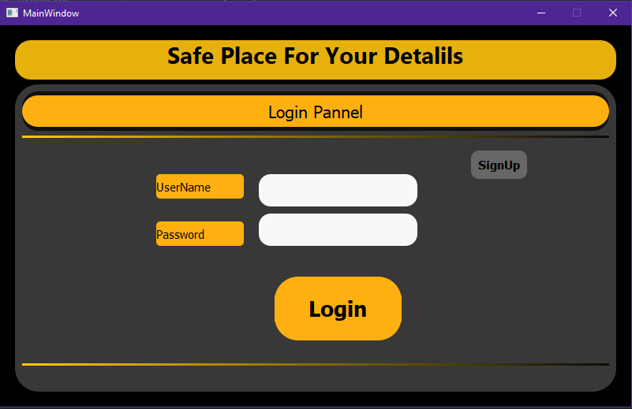
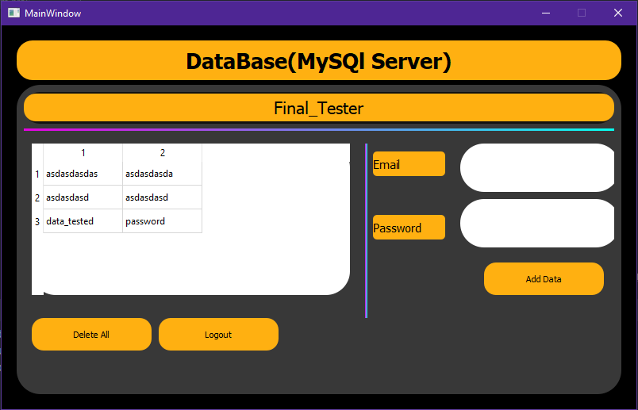
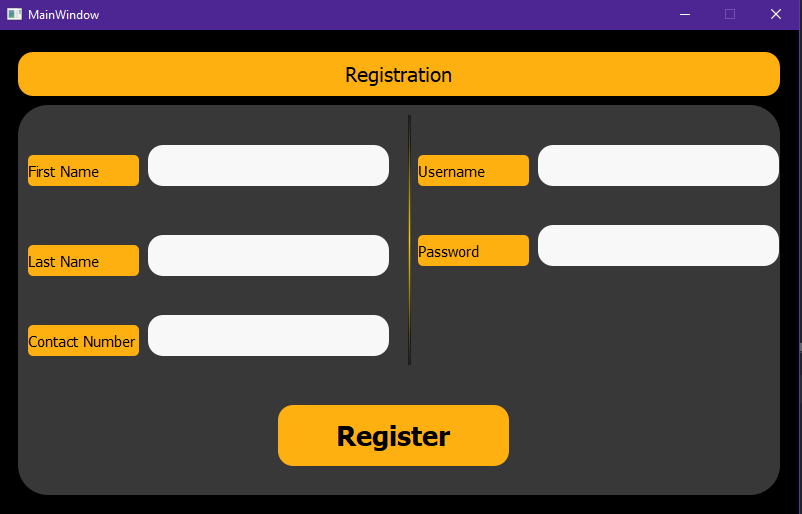

# Vault
Vault is a Modern GUI, Database driven login system, where users will be able to store their emails and password in a running MySql Server.

NOTE: After cloning the Repo on your machine, do remember to perfrom Following actios:
1) Chane some variables in the Connections_clone file such as :
host-name, user,password,database, according to your Mysql Server.

2) Make sure to change the name of database to you your personal  databse name inside connections_clone in
function like:create_database,delete_database
.
3) Be Sure to personalize the connections_clone for your machine and ENjoy..

Some of the Working IMages of the Applications are:

1) Login page

2) Client's Data Page

3) Registeration page

